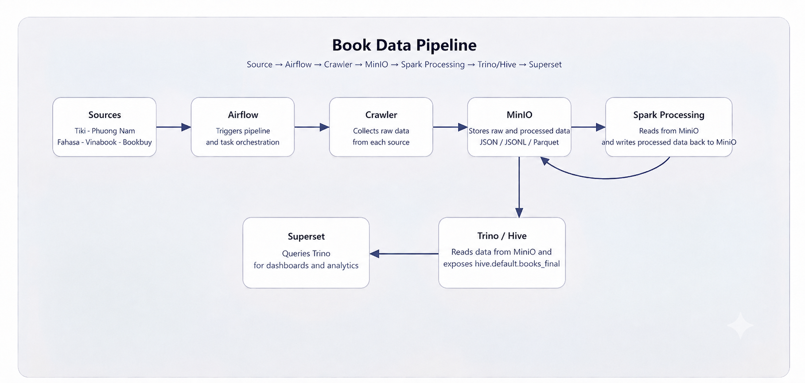

# Book-Data-Pipeline

A local end-to-end data pipeline for collecting, processing, and querying book data from multiple Vietnamese e-commerce sources.

## Overview

This project ingests product data from Tiki, Phương Nam, Fahasa, Vinabook, and Bookbuy, stores raw data in MinIO, orchestrates processing with Airflow, normalizes and deduplicates records with Spark, and exposes the final dataset through Trino/Hive.

## Architecture



1. Crawlers collect data from each source.
2. Raw JSON/JSONL files are uploaded to MinIO.
3. The Airflow DAG `book_data_pipeline` orchestrates the workflow:
   - crawl tasks
   - Spark processing and normalization
   - Hive/Trino metadata update
   - validation
4. The final dataset is available for querying through Trino and can be visualized in Superset.

## Tech Stack

- Python
- Apache Airflow
- Apache Spark
- MinIO
- Trino
- Superset
- Docker Compose

## Quick Start

### Prerequisites

- Docker Desktop
- Docker Compose

### 1. Copy the example environment file

```bash
copy .env.example .env
```

### 2. Start the services

```bash
docker compose up -d --build
```

### 3. Access the services

- Airflow UI: http://localhost:8081
- MinIO Console: http://localhost:9001
- Superset: http://localhost:8088
- Trino: http://localhost:8080

Default Airflow credentials:
- Username: `airflow`
- Password: `airflow`

You can override ports and credentials through the `.env` file.

### 3. Run the pipeline

Open the Airflow UI, locate the DAG `book_data_pipeline`, and trigger it.

### 4. Verify the output

- Raw files are stored in the MinIO bucket `data-lake`
- Processed outputs are written under `airflow/data/processed`
- The final table is available as `hive.default.books_final`

## Project Structure

- `airflow/dags/book_pipeline_dag.py` — main Airflow DAG
- `airflow/src/` — crawlers, Spark processing, validation, and metadata update logic
- `docker-compose.yml` — service orchestration
- `requirements.txt` — Python dependencies

## Notes

- Fahasa may be affected by Cloudflare challenges, so it is treated as an optional source during validation.
- The validation step checks the final Trino/Hive table and expects the main sources to be present.
- For production deployments, replace placeholder secrets in `.env` with your own values before starting the stack.

